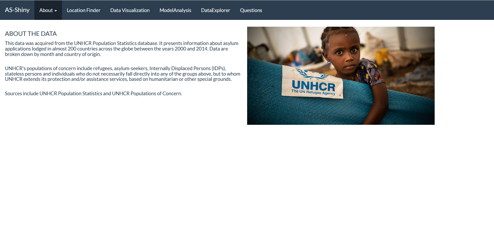

# R-shiny-app-project

In this project, I designed a Shiny app on the Asylum data. The app provides a variety of advanced statistical methods such as:
- data analysis methods (e.g. machine learning models, linear models, tools for checking the assumptions of each model, specific summary tables for the results of each model, etc.)
- data visualization tools (e.g. facet, violin plots, scatter plots, log plots, box plots, plots of machine learning models, and mulltiple options to customize each plot)
- advanced search options to filter and view the dataset
- interactive map to view and explore the variables and data in each country

  ----------------------------------------------------
  
At the moment, the best way to run the app is to directly run the AS-Shiny.R file. Unfortunately, the shinyapp server is a bit weak to handle complex apps like this (after all, R was designed for convenient data analysis, not for designing web apps). The current configuration can be found [here](https://amogharab.shinyapps.io/AS-Shiny/) but because of the server problems (and depending on your browser), you might need to refresh the page multiple times to get the app to run properly. I might design a custom architecture to fix this later on.

